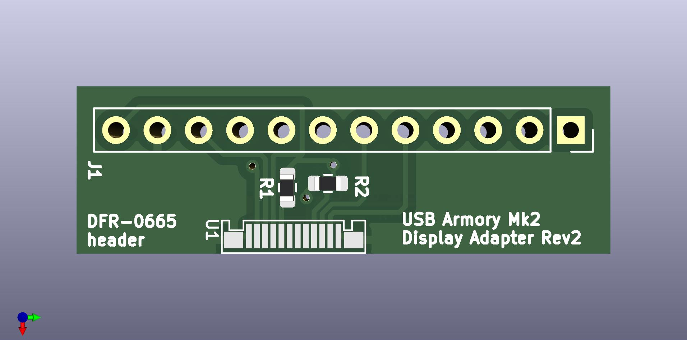

# USB armory MkII DFR-0665 touchscreen adapter board
This is a touchscreen expansion board for [USB armory MKII](https://github.com/usbarmory/usbarmory/wiki/Mk-II-Introduction) based on the prior design of its [debug accessory](https://github.com/usbarmory/usbarmory/tree/master/hardware/mark-two-debug-accessory). It's meant to be used with the [DFR-0665 touchscreen](https://www.dfrobot.com/product-2106.html). **Due to firmware limitations, this is currently not a plug and play solution. In addition, it's provided without any implied warranties.**

## PCB information

- 2 layers, 0.80mm thickness, top only components
- dimensions: 10.29 mm * 32.77 mm

## Bill of materials
2x 56k OHM 1% 1/8W 0603

## Backlight
You'll need to drive the backlight pin (BLK) yourself through either a pull-up or a pull-down resistor installed on the backside.

## DFR-0665 materials
- [Product Wiki](https://wiki.dfrobot.com/2.8inches_320_240_TFT_LCD_Touchscreen_SKU_DFR0665)
- [Schematic](https://dfimg.dfrobot.com/nobody/wiki/589a70b813aacacc28abeec16a451343.pdf)
